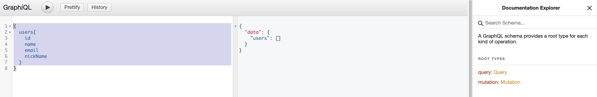

# GraphQL

## Endpoint

http://localhost:8080/graphiql


### query - users
```graphql
{
  users{
    id 
    name
    email
    nickName
  }
}
```



### mutation - user

```graphql
mutation {
  createUser(input: {name: "Logan", email: "logan.81k@gmail", nickName: "울트라짱"}) {
    id
    name
    email
    nickName
  } 
}
```


### query - users
```graphql
{
  users{
    id 
    name
    email
    nickName
  }
}
```


### query - user(id: 1) name, email only
```graphql
{
  user(id: 1) {
    name
    email
  }
}
```

